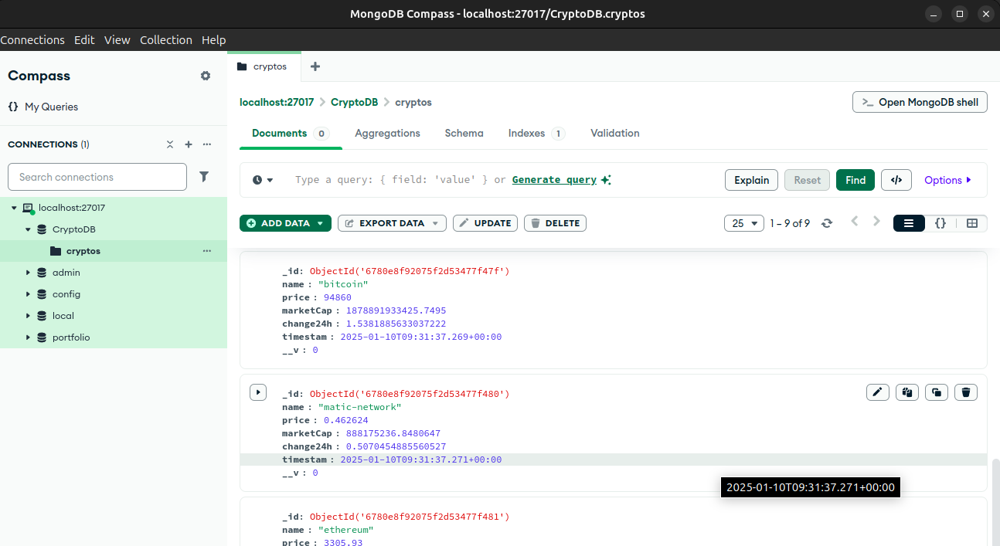
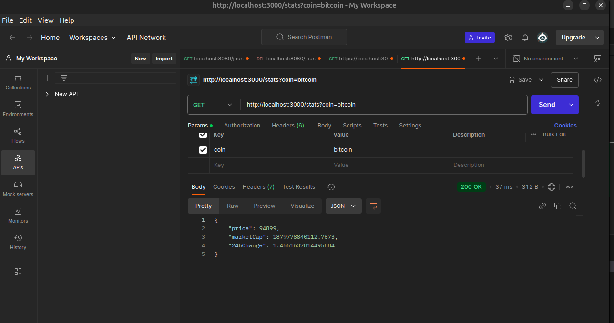
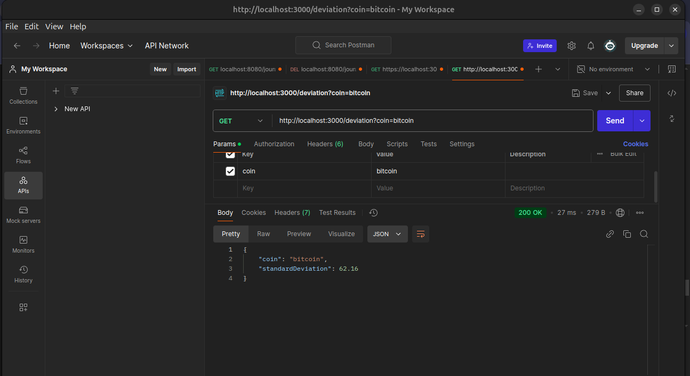

# Assignment for koinx

A Node.js and MongoDB application to track cryptocurrency statistics with background jobs and RESTful APIs.

## Features

1. **Background Job**:
   - Fetches the price, market cap, and 24-hour change of Bitcoin, Matic, and Ethereum every 2 hours using the CoinGecko API.

2. **API Endpoints**:
   - `/stats`: Get the latest stats (price, market cap, 24-hour change) for a specific cryptocurrency.
   - `/deviation`: Calculate the standard deviation of the price for the last 100 records of a specific cryptocurrency.

## Installation

1. Clone the repository:
   ```bash
   git clone https://github.com/Omkar-Abhang/koinx-assignment.git
   cd koinx-assignment
   
2.Install dependencies:

```bash

npm install
```

# Set up environment variables in .env:

```
COINGECKO_API=https://api.coingecko.com/api/v3/simple/price
MONGO_URI=mongodb://localhost:27017/CryptoDB
```

# Start the server:
```
node server.js
```

# API Documentation

1. /stats
Method: GET
Query Params: coin (e.g., bitcoin, matic-network, ethereum)
Response:

```json

{
    "price": 93747,
    "marketCap": 1858129089046.7358,
    "24hChange": -0.710889601061642
}
```

2. /deviation
Method: GET
Query Params: coin
Response:

```json

{
    "coin": "bitcoin",
    "standardDeviation": 356.33
}
```

# Screenshots:

### Background Job


### API `/stats`


### API `/deviation`



Author
Developed by Omkar Abhang.
